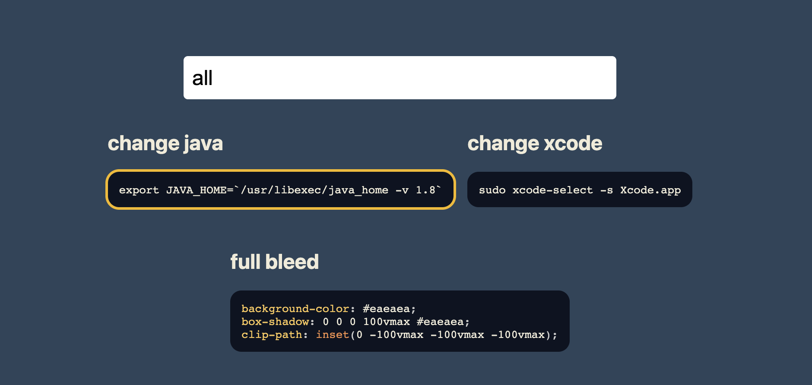

# Snippets

A chrome extension that allows you to save code snippets for the current google login.

<image src="./assets/screenshot.png" alt="snippet" style="max-width: 80vw; border-radius: 1em; margin: 1em 0;"/>

<!--  -->

## Installation

Got to [chrome://extensions](chrome://extensions/) and enable `developer mode`. Then click on `Load unpacked extension` and select the folder where you cloned this repository.

## Usage

To save a snippet, click the yellow plus button in the bottom right corner. To view the snippets, just search (fuzzy search) for the `key` you used to save the snippet.

### Shortcuts
1. Use `cmd + delete` while hovering over a snippet to delete it. 
2. Search `all` to view all snippets.
3. Search `clear` to clear all snippets from the screen.
